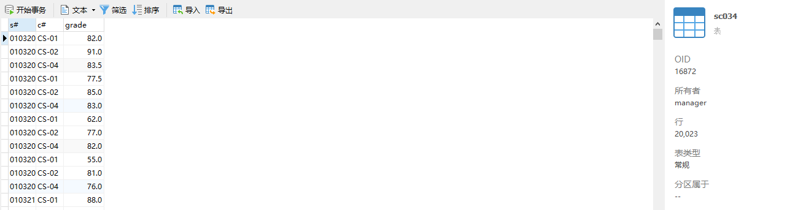

# DataBaseLab-XJTU

西交数据库系统实验

2024春

## 一、MYDB与表的创建

启动OpenGauss数据库，命令如下

```bash
su - omm 
gs_om -t start
gsql -d MYDB -p 26000
```

创建 MYDB 数据库 ，并在 MYDB 中建立学生、课程、选课三个表  。

各表包含属性如下：

- S034 （S#， SNAME， SEX， BDATE， HEIGHT， DORM）
- C034 （C#， CNAME， PERIOD， CREDIT， TEACHER）
- SC034（S#， C#， GRADE）其中 S#、 C#均为外键  

## 二、基础数据插入

属性设计如下

S034：


C034：


SC034：


由于插入的数据量较小，使用基础插入命令即可。

录入数据情况如下：

注：此处图为后面补充，因此相关信息已更新

S034：


C034：


SC034：


## 三、SQL操作

### 3.1 SQL基本查询

(1) 查询电子工程系（EE） 所开课程的课程编号、课程名称及学分数。

```mysql
SELECT C#, CNAME, CREDIT
FROM C034
WHERE LEFT(C#, 2) = 'EE';
```


(2) 查询未选修课程“CS-02”的女生学号及其已选各课程编号、 成绩。

```mysql
SELECT SC034.S#, SC034.C#, SC034.GRADE
FROM SC034, S034
WHERE SC034.S# = S034.S#
  AND S034.SEX = '女' 
  AND S034.S# NOT IN (
    SELECT DISTINCT SC034.S#
    FROM SC034
    WHERE SC034.C# = 'CS-02'
  );
```


(3) 查询 2002 年～2003 年出生学生的基本信息。

```mysql
SELECT S.S#, S.SNAME, S.SEX, S.BDATE, S.HEIGHT, S.DORM
FROM S034 AS S
WHERE EXTRACT(isoyear FROM S.BDATE) BETWEEN 2002 AND 2003
```


(4) 查询每位学生的学号、 学生姓名及其已选修课程的学分总数。

```mysql
SELECT S.S#, S.SNAME, SUM(CREDIT) AS SELECTED_CREDIT
FROM S034 AS S, C034 AS C,SC034 AS SC
WHERE S.S# = SC.S# AND SC.C# = C.C#
GROUP BY S.S#
```


(5) 查询选修课程“CS-01”的学生中成绩第二高的学生学号。

```mysql
SELECT S#
FROM SC034
WHERE  C# = 'CS-01'
  AND GRADE = (
    SELECT MAX(GRADE)
    FROM SC034
    WHERE C# = 'CS-01'
      AND GRADE < (
        SELECT MAX(GRADE)
        FROM SC034
        WHERE C# = 'CS-01'
       )
  );
```


(6) 查询平均成绩超过“王涛“同学的学生学号、 姓名和平均成绩， 并按学号进行降序排列。

```mysql
SELECT S.S#,SNAME,AVG(GRADE)
FROM SC034 AS SC,S034 AS S
WHERE SC.S# = S.S#
GROUP BY S.S#
HAVING AVG(GRADE) > (
	SELECT AVG(GRADE)
	FROM SC034 AS SC, S034 AS S
	WHERE SC.S# = S.S#
	  AND S.SNAME = '王涛'
	GROUP BY S.S#)
ORDER BY S.S# DESC
```


(7)查询选修了计算机专业全部课程（课程编号为“ CS-×× ”） 的学生姓名及已获得的学分总数。

```mysql
SELECT SNAME,SUM(
  CASE
    WHEN GRADE BETWEEN 60 AND 100 THEN CREDIT
	  ELSE 0
  END) AS GOT_CREDIT
FROM S034 AS S,SC034 AS SC,C034 AS C
WHERE C.C# LIKE 'CS-%' 
  AND C.C# = SC.C# AND SC.S# = S.S#
GROUP BY S.S#
HAVING COUNT(*) = (
  SELECT COUNT(C#)
  FROM C034
  WHERE C# LIKE 'CS-%'
)
```


(8) 查询选修了 3 门以上课程（包括 3 门)的学生中平均成绩最高的同学学号及姓名。  

```mysql
SELECT S.S#, S.SNAME
FROM S034 AS S, SC034 AS SC
WHERE S.S# = SC.S#
	AND S.S# in (
		SELECT S# 
		FROM SC034
		GROUP BY S#
		HAVING COUNT(*) >= 3
	)
GROUP BY S.S#
HAVING AVG(GRADE) >= ALL(
	SELECT AVG(GRADE)
	FROM SC034
	GROUP BY S#
	HAVING COUNT(*) >= 3
)
```


### 3.2 加入记录

分别在 S034 和 C034表中加入记录(‘01032005’，‘刘竞’，‘男’，‘2003-12-10’， 1.75，‘东 14 舍 312’ )及(‘CS-03’，“离散数学”， 64， 4，‘陈建明’ )  

```mysql
INSERT INTO S034 
VALUES('01032005','刘竞','男','2003-12-10',1.75,'东 14 舍 312' )
```


```mysql
INSERT INTO C034 
VALUES('CS-03','离散数学',64, 4,'陈建明' )
```


### 3.3 将 S034表中已修学分数大于 60 的学生记录删除

```mysql
DELETE FROM S034
WHERE S# IN(
	SELECT 
	FROM SC034 AS SC,C034 AS C
	WHERE SC.C# = C.C# 
	GROUP BY SC.S#
	HAVING SUM(CREDIT) > 60
)
```


### 3.4 将“张明”老师负责的“信号与系统”课程的学时数调整为 64，同时增加一个学分

```mysql
UPDATE C034
SET  PERIOD = 64, CREDIT = CREDIT + 1
WHERE TEACHER = '张明' AND CNAME = '信号与系统'
```


### 3.5 建立如下视图：

(1)居住在“东 18 舍”的男生视图，包括学号、姓名、出生日期、身高等属
性。

```mysql
CREATE VIEW DORM_IN_EAST_18_MEN 
AS
SELECT S#, SNAME, BDATA, HEIGHT
FROM S034
WHERE SEX = '男' AND DORM like '东18 舍'
```


(2)“张明”老师所开设课程情况的视图，包括课程编号、课程名称、平均成
绩等属性。

```mysql
CREATE VIEW COURSE_MingZhang
AS
SELECT C#, CNAME, AVG(GRADE)
FROM C034 AS C, SC034 AS SC
WHERE C.TEACHER = '张明'
	AND C.C# = SC.C#
GROUP BY C.C#
```


(3)所有选修了“人工智能”课程的学生视图，包括学号、姓名、成绩等属性。  

```mysql
CREATE VIEW STUDENT_WHO_CHOOSE_AI
AS
SELECT S#, SNAME, GRADE
FROM S034 AS S, SC034 AS SC, C034 AS C
WHERE CNAME = '人工智能' AND S.S# = SC.S# AND C.C# = SC.C#
```


## 四、扩充数据与性能优化

### 4.1 数据生成与插入

#### 4.1.1 数据生成：

1. 使用course_fetch.py在西交教务系统的全校课表中抓取课程信息，然后去除重复课程，生成course.csv。在该程序中，需要注意：

   请求头可以通过在浏览器按F12，进入网络项查看日志填充，其中`Cookie`项需要时常更新

   请求负载的填写比较麻烦，需要通过以下结构实现

   ```python
   data = {
   	"pageSize": 100,
    	"pageNumber": page_number,
    	"querySetting": json.dumps([
        	{"name": "XNXQDM", "value": "2023-2024-2", "linkOpt": "and", "builder": "equal"},
        	[
           	{"name": "RWZTDM", "value": "1", "linkOpt": "and", "builder": "equal"},
           	{"name": "RWZTDM", "linkOpt": "or", "builder": "isNull"}
         	]
   		]),
      	"*order": "+KKDWDM,+KCH,+KXH"
     }
   ```

2. 使用student_generate.py完成学生数据的生成（Student.csv），该程序生成的学生数据学号是唯一的。

   该程序使用`Faker`库生成学生姓名，其它信息则借助`random`方法生成

3. 使用sc_generate.py生成选课记录sc.csv，选课记录依赖于前面两个程序生成的csv文件。

#### 4.2.2 数据插入

通过data_insert.java实现。为了通过JDBC插入数据，需要创建java项目，并链接驱动库。具体而言，就是需要链接postgresql.jar。

准备过程完成后，可以在代码中使用下面的函数创建连接

```java
 conn = DriverManager.getConnection(DB_URL, USER, PASS);
```

下面是`DB_URL`的填写格式：

```java
static final String DB_URL = "jdbc:postgresql://1.92.85.164:26000/MYDB?ApplicationName=app1&useUnicode=true&characterEncoding=utf8";
```

> [!NOTE]
>
> /MYDB?处填写自己创建的数据库名称，此处区分大小写。

> [!CAUTION]
>
> JDBC连接成功后即可编写程序实现插入，但是可能会报错：ERROR:  relation "xxx" does not exist on dn_6001
>
> 这是因为虽然连接上了数据库，但并不会自动进入关系模式。为解决此问题，程序中的sql命令可以参照如下格式：
>
> ```java
> String sql = "INSERT INTO \"My_mode\".\"s034\" (S#, SNAME, SEX, BDATE, HEIGHT, DORM) VALUES (?, ?, ?, ?, ?, ?)";
> ```
>
> 应当确保选择了关系模式且加入引号。此处可能是大小写敏感的，本人使用S034报错而使用s034正常。

下面给出插入学生信息的函数`insertStudents`的代码

```java
public static void insertStudents(Connection conn, String filePath) {
	//System.out.println("t0");
    String sql = "INSERT INTO \"My_mode\".\"s034\" (S#, SNAME, SEX, BDATE, HEIGHT, DORM) VALUES (?, ?, ?, ?, ?, ?)";
    int i = 0;
    try (BufferedReader br = new BufferedReader(
			new InputStreamReader(new FileInputStream(filePath), StandardCharsets.UTF_8));
        	PreparedStatement pstmt = conn.prepareStatement(sql)) {
      	String line;
      	while ((line = br.readLine()) != null) {
        	i++;
        	if (i == 1)
          		continue;
            //System.out.println(line);
            
            String[] values = line.split(",");
            pstmt.setString(1, values[0]);//.substring(1, 8)
            pstmt.setString(2, values[1]);
            pstmt.setString(3, values[2]);
            pstmt.setDate(4, java.sql.Date.valueOf(values[3]));
            pstmt.setFloat(5, Float.parseFloat(values[4]));
            pstmt.setString(6, values[5]);
            pstmt.executeUpdate();
            System.out.println("s suc++");
     	}
     	
    	System.out.println("Students data inserted successfully.");
    } catch (IOException | SQLException e) {
      e.printStackTrace();
    }
}
```

为了随机选择成绩删除，该程序定义了`DeleteRunnable`类，并在主函数中创建一线程完成删除工作。

```java
class DeleteRunnable implements Runnable {
	private Connection conn;
  	public DeleteRunnable(Connection conn) {
     	this.conn = conn;
	}
  	@Override
  	public void run() {
        System.out.println("t3");
        int deleted_num = 0;
        while (deleted_num < 200){ 
            String deleteSql = "DELETE FROM \"My_mode\".\"sc034\" WHERE S# IN (SELECT S# FROM \"My_mode\".\"sc034\" WHERE GRADE < 60 ORDER BY RANDOM() LIMIT 5) AND C# IN (SELECT C# FROM \"My_mode\".\"sc034\"WHERE GRADE < 60 ORDER BY RANDOM() LIMIT 5)";
            try (PreparedStatement pstmt = conn.prepareStatement(deleteSql)) {
                int rowsAffected = pstmt.executeUpdate();
                deleted_num += rowsAffected;
            } catch (SQLException e) {
                e.printStackTrace();
            }
            System.out.println(deleted_num + " SC records with GRADE < 60 deleted successfully.");
            try{
                Thread.sleep(5000);
            } catch (InterruptedException e) {
                e.printStackTrace();
            }
        }
    }
}
```

> [!IMPORTANT]
>
> 在使用data_insert.java插入时，应该将之前生成的csv文件另存为utf-8格式。其中，在插入Student.csv时，需要在excel中把`BDATE`列的单元格格式设置成日期。
>
> 该程序导入较慢，直接使用Navicat的导入效率更高。


### 4.2 第一次数据扩充

 在 S034表中补充数据至约 1000 行，在 C034表中补充数据至约 100行，在 SC034表中补充数据至约 20000 行。在向 SC034表中补充数据的过程中，随机选择成绩低于 60 分的 200 行选课记录删除。（计算机专业同学实现以上数据添加和删除的存取过程时不得在同一程序中逐行串行完成。）

S034：


C034：


SC034：



### 4.3 第二次数据扩充与性能优化

#### 4.3.1 第二次数据扩充

在 S034表中补充数据至约 5000 行，在 C034表中补充数据至约 1000行，在 SC034表中补充数据至约 200000 行。

类似地，扩充数据，情况如下

S034：


C034：


SC034：


#### 4.3.2 性能优化

为3.1中的部分查询（不少于 3 个）编写不同的 SQL 语句实现， 并分析其运行效率。如果可能，请尝试给出可提高查询效率的改进方法。

1. **查询未选修课程“CS-02”的女生学号及其已选各课程编号、 成绩。**

   ```mysql
   SELECT SC034.S#, SC034.C#, SC034.GRADE
   FROM SC034, S034
   WHERE SC034.S# = S034.S#
     AND S034.SEX = '女' 
     AND S034.S# NOT IN (
       SELECT DISTINCT SC034.S#
       FROM SC034
       WHERE SC034.C# = 'CS-02'
     );
   ```

   运行结果：

   

   解释分析：

   

发现其中需要顺序扫描SC中的C#属性，消耗过大。

优化建议：对SC的C#加入索引

```mysql
CREATE INDEX idx_sc034_c ON SC034(C#);
```

解释分析：


性能得到约28%的优化。

2. **查询选修了计算机专业全部课程（课程编号为“ CS-×× ”） 的学生姓名及已获得的学分总数。**

```mysql
SELECT SNAME,SUM(
  CASE
    WHEN GRADE BETWEEN 60 AND 100 THEN CREDIT
	  ELSE 0
  END) AS GOT_CREDIT
FROM S034 AS S,SC034 AS SC,C034 AS C
WHERE C.C# LIKE 'CS-%' 
  AND C.C# = SC.C# AND SC.S# = S.S#
GROUP BY S.S#
HAVING COUNT(*) = (
  SELECT COUNT(C#)
  FROM C034
  WHERE C# LIKE 'CS-%'
)
```

查询结果为空，因为新增许多计算机课程而没有学生选修了全部课程。

解释分析：


发现查询受限于表的连接，其中影响最大的是 `C.C# = SC.C#`的处理上。

优化建议：对SC的C#加入索引（虽然还有一些属性也可以创建索引，但是对性能提升不大）

```mysql
CREATE INDEX idx_sc034_c ON SC034(C#);
```

解释分析：


性能得到约55%的优化。

3. **查询选修了 3 门以上课程（包括 3 门)的学生中平均成绩最高的同学学号及姓名。**  

   ```mysql
   SELECT S.S#, S.SNAME
   FROM S034 AS S, SC034 AS SC
   WHERE S.S# = SC.S#
   	AND S.S# in (
   		SELECT S# 
   		FROM SC034
   		GROUP BY S#
   		HAVING COUNT(*) >= 3
   	)
   GROUP BY S.S#
   HAVING AVG(GRADE) >= ALL(
   	SELECT AVG(GRADE)
   	FROM SC034
   	GROUP BY S#
   	HAVING COUNT(*) >= 3
   )
   ```

   运行结果：

   

   解释分析：

   

   该查询中的嵌套查询和重复计算（两次作`HAVING COUNT(*) >= 3`的计算）严重影响了查询效率

   优化建议：使用CTE（Common Table Expressions）来简化逻辑，减少重复计算。通用表表达式（CTE）是一个临时命名的结果集，我们可以在 SELECT、INSERT、UPDATE 或 DELETE 语句中引用。下面是修改后的查询代码：

   ```mysql
   WITH FilteredSC AS (
       SELECT S#, AVG(GRADE) AS AvgGrade
       FROM SC034
       GROUP BY S#
       HAVING COUNT(*) >= 3
   ),
   MaxAvgGrade AS (
       SELECT MAX(AvgGrade) AS MaxAvg
       FROM FilteredSC
   )
   SELECT S.S#, S.SNAME
   FROM S034 AS S
   JOIN FilteredSC AS SC ON S.S# = SC.S#
   CROSS JOIN MaxAvgGrade
   WHERE SC.AvgGrade >= MaxAvgGrade.MaxAvg;
   ```

   执行结果不变

   解释分析：

   

   性能得到约63%的优化。

   4.  **扫描的说明**

   在上面的解释分析图中，可以发现出现了SeqScan、IndexScan和BitmapIndexScan。下面作比较总结：

   **SeqScan（顺序扫描）**：顺序扫描会读取整个表的每一行来查找满足条件的行,其不依赖索引，直接从磁盘顺序读取表的数据页。

   使用场景：

   - 小表：表非常小，顺序扫描比索引扫描更有效率，因为读取所有数据的开销较低。
   - 大部分行匹配：查询条件匹配表中大多数行时，顺序扫描比索引扫描更有效，因为顺序读取数据页的成本低于随机读取。
   - 无可用索引：没有适用的索引可以利用时，只能使用顺序扫描。

   优缺点：

   - 优点：对小表或大部分行匹配时效率高，读数据的顺序性减少了磁盘I/O。
   - 缺点：对大表和只匹配少数行的查询效率低。

   **IndexScan（索引扫描）**：索引扫描通过索引定位到满足条件的行，然后根据索引查找相应的数据页。

   使用场景：

   - 查询条件与索引匹配：当查询条件正好匹配表上的索引时，索引扫描能快速定位到满足条件的行。
   - 少量行匹配：查询条件匹配的行数较少时，索引扫描比顺序扫描更高效，因为它可以跳过不相关的数据页。
   - 有序输出：需要排序的结果集，如果索引已经按照查询所需顺序排序，可以避免额外的排序步骤。

   优缺点：

   - 优点：对大表且少量行匹配的查询效率高，能利用索引快速定位数据。
   - 缺点：对大量行匹配的查询效率较低，因为可能涉及大量随机I/O。

   **BitmapIndexScan（位图索引扫描）**：位图索引扫描使用位图索引来快速定位满足查询条件的行。它先在索引上执行查询，生成一个位图，表示满足条件的行所在的页面（page），然后通过位图来快速定位和读取这些数据页。该方式通常与 BitmapHeapScan 结合使用，后者负责根据位图访问表中的数据。

   使用场景：

   - 中等数量行匹配：查询条件匹配的行数介于少量和大部分之间时，位图扫描比顺序扫描和索引扫描更高效。
   - 多列条件查询：多个条件需要使用多个索引时，可以合并多个位图，减少数据页读取次数。
   - 大表：在大表中进行复杂条件的查询，位图扫描可以减少读取的数据页数量，提高效率。

   优缺点：

   - 优点：在匹配行数适中时效率高，能够合并多个索引结果，减少不必要的I/O操作。
   - 缺点：在极少或极多行匹配的情况下效率不如索引扫描或顺序扫描。

   **总结**

   - SeqScan：适用于小表或大部分行匹配的查询，无需索引。
   - IndexScan：适用于大表且少量行匹配的查询，利用索引快速定位数据。
   - BitmapIndexScan：适用于中等数量行匹配或多列条件查询，通过位图减少I/O操作。
